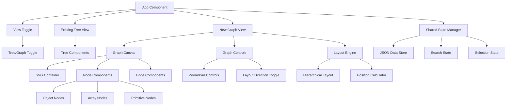

# Design Document

## Overview

The JSON Crack-like graph view feature will extend the existing JSON visualization app by adding a structured node-link diagram visualization similar to JSONCrack. This feature will transform JSON data into a hierarchical graph where objects, arrays, and primitive values are represented as rectangular nodes connected by lines. The design uses native SVG rendering with Vue 3 components and custom layout algorithms, eliminating the need for D3.js while providing a clean, predictable visualization that matches JSONCrack's approach.

## Architecture

The graph view feature will integrate into the existing application architecture as a new visualization mode using a JSONCrack-inspired approach:



### Technology Integration

- **Graph Rendering**: Native SVG with Vue 3 components for clean, predictable rendering
- **Layout Algorithms**: Custom hierarchical layout engine inspired by JSONCrack's approach
- **Vue Integration**: Pure Vue 3 composables for state management and reactivity
- **State Management**: Extend existing Pinia store to include graph-specific state
- **Performance**: Virtual scrolling and viewport culling for large datasets

## Components and Interfaces

### New Components

#### 1. GraphView Component

- **Purpose**: Main container for the graph visualization
- **Props**: `jsonData: ParsedJSON`, `searchQuery: string`, `selectedPath: string[]`
- **State**: Graph layout, zoom/pan state, node positions
- **Responsibilities**:
  - Initialize D3 force simulation and SVG container
  - Handle view switching from tree to graph mode
  - Manage graph layout and rendering lifecycle
  - Coordinate with existing search and selection state

#### 2. GraphCanvas Component

- **Purpose**: SVG canvas for rendering nodes and edges in JSONCrack style
- **Props**: `nodes: GraphNode[]`, `edges: GraphEdge[]`, `width: number`, `height: number`
- **State**: Zoom transform, viewport bounds, layout direction
- **Responsibilities**:
  - Render SVG elements for rectangular nodes and connecting lines
  - Handle hierarchical layout positioning
  - Manage zoom and pan interactions with transform matrix
  - Implement viewport culling for performance with large graphs

#### 3. GraphNode Component

- **Purpose**: Individual rectangular node representation in JSONCrack style
- **Props**: `node: GraphNode`, `isSelected: boolean`, `isHighlighted: boolean`
- **State**: Hover state, expansion state
- **Responsibilities**:
  - Render rectangular nodes with all key-value pairs displayed inside the box
  - For object nodes: show all properties as rows within the node
  - For array nodes: show indices and values within the node
  - For primitive nodes: show the single value
  - Display connection points on the right edge for child object/array values
  - Handle node interactions (click, hover, expand/collapse)
  - Apply JSONCrack-style visual theming based on data type

#### 4. GraphControls Component

- **Purpose**: UI controls for graph manipulation in JSONCrack style
- **Props**: `layoutDirection: 'horizontal' | 'vertical'`, `zoomLevel: number`
- **State**: Control panel visibility, layout direction
- **Responsibilities**:
  - Provide zoom in/out and fit-to-screen controls
  - Toggle between horizontal and vertical layout directions
  - Include minimap for large graph navigation
  - Handle graph export and fullscreen functionality

#### 5. ViewToggle Component

- **Purpose**: Switch between tree and graph views
- **Props**: `currentView: 'tree' | 'graph'`, `onViewChange: (view: ViewType) => void`
- **State**: Active view state
- **Responsibilities**:
  - Provide intuitive toggle interface
  - Maintain view state during JSON data changes
  - Handle smooth transitions between views

### Enhanced Interfaces

```typescript
interface GraphNode {
  id: string
  key: string | number
  value: any
  type: 'object' | 'array' | 'string' | 'number' | 'boolean' | 'null'
  path: string[]
  x: number
  y: number
  width: number
  height: number
  children: string[] // Node IDs of child objects/arrays only
  parent?: string // Node ID of parent
  depth: number
  isExpanded: boolean
  hasChildren: boolean
  properties: NodeProperty[] // All key-value pairs displayed in this node
}

interface NodeProperty {
  key: string | number
  value: any
  type: 'object' | 'array' | 'string' | 'number' | 'boolean' | 'null'
  hasChildNode: boolean // True if this property connects to a child node
  childNodeId?: string // ID of connected child node if hasChildNode is true
}

interface GraphEdge {
  id: string
  source: string // Node ID
  target: string // Node ID
  sourcePoint: { x: number; y: number }
  targetPoint: { x: number; y: number }
  type: 'parent-child' | 'array-item'
}

interface GraphState {
  nodes: GraphNode[]
  edges: GraphEdge[]
  selectedNodeId: string | null
  highlightedNodes: Set<string>
  layoutDirection: 'horizontal' | 'vertical'
  zoomTransform: {
    x: number
    y: number
    scale: number
  }
  viewportBounds: {
    minX: number
    minY: number
    maxX: number
    maxY: number
  }
}

interface LayoutOptions {
  nodeSpacing: number
  levelSpacing: number
  nodeWidth: number
  nodeHeight: number
  direction: 'horizontal' | 'vertical'
}
```

## Data Models

### JSON to Graph Transformation

The transformation process converts the existing JSON tree structure into a JSONCrack-style graph representation:

1. **Node Creation**: Each JSON element becomes a rectangular graph node with calculated dimensions
2. **Edge Generation**: Parent-child relationships become connecting lines with specific connection points
3. **Layout Calculation**: Hierarchical positioning similar to JSONCrack's approach
4. **Type Classification**: Preserve data type information for JSONCrack-style visual theming

```typescript
class GraphBuilder {
  static buildGraph(
    jsonData: ParsedJSON,
    layoutOptions: LayoutOptions,
  ): { nodes: GraphNode[]; edges: GraphEdge[] } {
    const nodes: GraphNode[] = []
    const edges: GraphEdge[] = []

    function traverse(
      data: any,
      path: string[],
      parent?: GraphNode,
      depth = 0,
      parentKey?: string,
    ) {
      const nodeId = path.join('.')
      const properties: NodeProperty[] = []
      const children: string[] = []

      // For objects and arrays, create properties for all key-value pairs
      if (typeof data === 'object' && data !== null) {
        Object.entries(data).forEach(([key, value]) => {
          const valueType = getDataType(value)
          const isContainer = valueType === 'object' || valueType === 'array'

          if (isContainer) {
            // This property will connect to a child node
            const childNodeId = [...path, key].join('.')
            properties.push({
              key,
              value,
              type: valueType,
              hasChildNode: true,
              childNodeId,
            })
            children.push(childNodeId)

            // Recursively create child node
            traverse(value, [...path, key], node, depth + 1, key)
          } else {
            // This property is displayed inline (primitive value)
            properties.push({
              key,
              value,
              type: valueType,
              hasChildNode: false,
            })
          }
        })
      } else {
        // For primitive values, create a single property
        properties.push({
          key: parentKey || 'value',
          value: data,
          type: getDataType(data),
          hasChildNode: false,
        })
      }

      const node: GraphNode = {
        id: nodeId,
        key: parentKey || 'root',
        value: data,
        type: getDataType(data),
        path: [...path],
        depth,
        x: 0, // Will be calculated by layout engine
        y: 0, // Will be calculated by layout engine
        width: calculateNodeWidth(properties, layoutOptions),
        height: calculateNodeHeight(properties, layoutOptions),
        children,
        parent: parent?.id,
        isExpanded: true,
        hasChildren: children.length > 0,
        properties,
      }

      nodes.push(node)
    }

    traverse(jsonData, [])

    // Calculate positions using hierarchical layout
    const positionedNodes = HierarchicalLayout.calculatePositions(nodes, layoutOptions)

    // Generate edges from properties that have child nodes
    const graphEdges = EdgeBuilder.createEdgesFromProperties(positionedNodes)

    return { nodes: positionedNodes, edges: graphEdges }
  }
}

class EdgeBuilder {
  static createEdgesFromProperties(nodes: GraphNode[]): GraphEdge[] {
    const edges: GraphEdge[] = []

    nodes.forEach((node) => {
      node.properties.forEach((property, index) => {
        if (property.hasChildNode && property.childNodeId) {
          const targetNode = nodes.find((n) => n.id === property.childNodeId)
          if (targetNode) {
            // Calculate connection points
            const sourcePoint = {
              x: node.x + node.width, // Right edge of source node
              y: node.y + (index + 1) * (node.height / (node.properties.length + 1)), // Align with property row
            }
            const targetPoint = {
              x: targetNode.x, // Left edge of target node
              y: targetNode.y + targetNode.height / 2, // Center of target node
            }

            edges.push({
              id: `${node.id}-${property.childNodeId}`,
              source: node.id,
              target: property.childNodeId,
              sourcePoint,
              targetPoint,
              type: property.type === 'array' ? 'array-item' : 'parent-child',
            })
          }
        }
      })
    })

    return edges
  }
}
```

### JSONCrack-Style Node Structure

Each node in the graph represents a JSON container (object or array) and displays all its immediate properties within the node box:

- **Object Nodes**: Display all key-value pairs as rows within the node
  - Primitive values are shown inline (e.g., `"name": "John"`)
  - Object/array values show the key and type, with a connection line to a child node
- **Array Nodes**: Display indices and values within the node
  - Primitive values are shown inline (e.g., `[0]: "apple"`)
  - Object/array values show the index and type, with a connection line to a child node
- **Root Node**: The leftmost node representing the entire JSON structure
- **Child Nodes**: Connected nodes to the right representing nested objects/arrays

### Layout Algorithms

#### Hierarchical Layout (JSONCrack Style)

- **Use Case**: Primary layout algorithm matching JSONCrack's visual approach
- **Algorithm**: Left-to-right hierarchical positioning with root as leftmost node
- **Positioning**:
  - Root node positioned at the leftmost position (depth 0)
  - Child nodes positioned to the right of their parents (depth + 1)
  - Vertical spacing calculated to prevent node overlaps
  - Nodes at the same depth level are vertically distributed
- **Spacing**: Dynamic spacing based on node content, property count, and sibling relationships
- **Benefits**: Predictable, clean layout that matches JSONCrack's left-to-right flow

```typescript
class HierarchicalLayout {
  static calculatePositions(nodes: GraphNode[], options: LayoutOptions): GraphNode[] {
    const nodesByDepth = this.groupNodesByDepth(nodes)

    // Always use left-to-right layout (JSONCrack style)
    return this.layoutLeftToRight(nodesByDepth, options)
  }

  private static layoutLeftToRight(
    nodesByDepth: Map<number, GraphNode[]>,
    options: LayoutOptions,
  ): GraphNode[] {
    const positionedNodes: GraphNode[] = []

    // Process each depth level from left to right
    nodesByDepth.forEach((nodesAtDepth, depth) => {
      const x = depth * (options.nodeWidth + options.levelSpacing)
      let currentY = 0

      nodesAtDepth.forEach((node, index) => {
        // Calculate Y position to avoid overlaps
        if (index > 0) {
          currentY += options.nodeSpacing
        }

        positionedNodes.push({
          ...node,
          x,
          y: currentY,
        })

        currentY += node.height
      })
    })

    return positionedNodes
  }

  private static groupNodesByDepth(nodes: GraphNode[]): Map<number, GraphNode[]> {
    const nodesByDepth = new Map<number, GraphNode[]>()

    nodes.forEach((node) => {
      if (!nodesByDepth.has(node.depth)) {
        nodesByDepth.set(node.depth, [])
      }
      nodesByDepth.get(node.depth)!.push(node)
    })

    return nodesByDepth
  }
}
```

## Error Handling

### Graph Rendering Errors

- **Large Dataset Handling**: Implement node clustering and level-of-detail rendering
- **Memory Management**: Use object pooling for nodes and links to prevent memory leaks
- **Performance Degradation**: Fallback to simplified rendering when frame rate drops
- **Browser Compatibility**: Graceful degradation for older browsers without full SVG support

### Layout Calculation Errors

- **Position Overflow**: Handle cases where calculated positions exceed viewport bounds
- **Invalid Data**: Validate graph structure before layout calculation
- **Circular References**: Detect and handle circular references in JSON data
- **Memory Cleanup**: Properly dispose of layout calculations when component unmounts

### User Interaction Errors

- **Zoom Limits**: Prevent excessive zoom that makes graph unusable
- **Node Dragging**: Handle edge cases where dragged nodes go off-screen
- **Selection State**: Maintain selection consistency when switching between views
- **Search Integration**: Ensure search highlighting works correctly in graph mode

## Testing Strategy

### Unit Testing

- **Graph Builder**: Test JSON to graph transformation with various data structures
- **Layout Algorithms**: Test hierarchical positioning and spacing calculations
- **Node Rendering**: Test rectangular node rendering and JSONCrack-style theming
- **Edge Rendering**: Test connection line calculations and rendering
- **Interaction Handlers**: Test click, hover, and expand/collapse behaviors

### Integration Testing

- **View Switching**: Test seamless transitions between tree and graph views
- **State Synchronization**: Test shared state management between views
- **Search Integration**: Test search functionality with node highlighting in graph mode
- **Layout Direction**: Test switching between horizontal and vertical layouts
- **Performance**: Test with large JSON datasets and measure SVG rendering performance

### Visual Testing

- **Layout Quality**: Verify graph layouts are readable and aesthetically pleasing
- **Responsive Design**: Test graph rendering on different screen sizes
- **Accessibility**: Test keyboard navigation and screen reader compatibility
- **Cross-browser**: Test D3 rendering consistency across browsers

## Implementation Considerations

### Performance Optimizations

- **Virtual Rendering**: Render only visible nodes when zoomed out
- **Node Clustering**: Group distant nodes into clusters for better performance
- **Canvas Fallback**: Use HTML5 Canvas for very large graphs (1000+ nodes)
- **Debounced Updates**: Debounce layout updates during continuous interactions
- **Web Workers**: Offload heavy graph calculations to background threads

### Accessibility Features

- **Keyboard Navigation**: Tab through nodes, arrow keys for graph navigation
- **Screen Reader Support**: ARIA labels for nodes and relationships
- **High Contrast Mode**: Alternative color schemes for better visibility
- **Focus Management**: Clear focus indicators and logical focus flow

### Integration with Existing Features

- **Search Compatibility**: Extend existing search to work with graph nodes
- **Copy Functionality**: Maintain copy-to-clipboard features for graph nodes
- **State Persistence**: Save graph layout preferences and zoom state
- **Error Handling**: Integrate with existing error handling and validation systems

### Native SVG Integration Strategy

- **Vue Composables**: Create composables for graph state management and layout calculations
- **Lifecycle Management**: Properly initialize and cleanup layout calculations and event listeners
- **Event Coordination**: Handle SVG events through Vue's native event system
- **Reactive Updates**: Reactively update graph layout when underlying JSON data changes

### Development Workflow

- **Task Completion**: After completing each implementation task, commit the changes with a descriptive commit message
- **Incremental Development**: Each task should result in a working, testable increment
- **Version Control**: Use meaningful commit messages that reference the specific task being completed
- **Testing**: Run tests after each task completion before committing

### Responsive Design

- **Mobile Adaptation**: Touch-friendly interactions and simplified controls
- **Container Sizing**: Dynamic sizing based on available viewport space
- **Layout Switching**: Automatic layout selection based on screen size
- **Performance Scaling**: Reduce visual complexity on mobile devices
