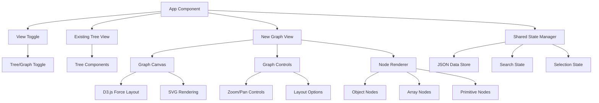

# Design Document

## Overview

The JSON Crack-like graph view feature will extend the existing JSON visualization app by adding an interactive node-link diagram visualization. This feature will transform JSON data into a spatial graph where objects, arrays, and primitive values are represented as connected nodes. The design leverages D3.js for graph rendering and layout algorithms while integrating seamlessly with the existing Vue 3 + Pinia architecture.

## Architecture

The graph view feature will integrate into the existing application architecture as a new visualization mode:



### Technology Integration

- **Graph Rendering**: D3.js v7 for SVG-based graph visualization and layout algorithms
- **Layout Algorithms**: D3 force simulation, hierarchical layout, and tree layout options
- **Vue Integration**: Vue 3 composables to wrap D3 functionality and manage reactivity
- **State Management**: Extend existing Pinia store to include graph-specific state
- **Performance**: Canvas fallback for large datasets, virtual rendering for complex graphs

## Components and Interfaces

### New Components

#### 1. GraphView Component

- **Purpose**: Main container for the graph visualization
- **Props**: `jsonData: ParsedJSON`, `searchQuery: string`, `selectedPath: string[]`
- **State**: Graph layout, zoom/pan state, node positions
- **Responsibilities**:
  - Initialize D3 force simulation and SVG container
  - Handle view switching from tree to graph mode
  - Manage graph layout and rendering lifecycle
  - Coordinate with existing search and selection state

#### 2. GraphCanvas Component

- **Purpose**: SVG canvas for rendering nodes and edges
- **Props**: `nodes: GraphNode[]`, `links: GraphLink[]`, `width: number`, `height: number`
- **State**: D3 simulation state, zoom transform
- **Responsibilities**:
  - Render SVG elements for nodes and connections
  - Handle D3 force simulation updates
  - Manage zoom and pan interactions
  - Implement level-of-detail rendering for performance

#### 3. GraphNode Component

- **Purpose**: Individual node representation in the graph
- **Props**: `node: GraphNode`, `isSelected: boolean`, `isHighlighted: boolean`
- **State**: Hover state, drag state
- **Responsibilities**:
  - Render different node types (object, array, primitive)
  - Handle node interactions (click, hover, drag)
  - Display tooltips and context menus
  - Apply visual styling based on data type

#### 4. GraphControls Component

- **Purpose**: UI controls for graph manipulation
- **Props**: `layoutType: LayoutType`, `zoomLevel: number`
- **State**: Control panel visibility, layout options
- **Responsibilities**:
  - Provide zoom in/out and reset controls
  - Offer layout algorithm selection
  - Include minimap for large graph navigation
  - Handle graph export functionality

#### 5. ViewToggle Component

- **Purpose**: Switch between tree and graph views
- **Props**: `currentView: 'tree' | 'graph'`, `onViewChange: (view: ViewType) => void`
- **State**: Active view state
- **Responsibilities**:
  - Provide intuitive toggle interface
  - Maintain view state during JSON data changes
  - Handle smooth transitions between views

### Enhanced Interfaces

```typescript
interface GraphNode {
  id: string
  key: string | number
  value: any
  type: 'object' | 'array' | 'string' | 'number' | 'boolean' | 'null'
  path: string[]
  x?: number
  y?: number
  fx?: number // Fixed position for dragging
  fy?: number
  children?: string[] // Node IDs of children
  parent?: string // Node ID of parent
  depth: number
  size: number // Visual size based on content
}

interface GraphLink {
  source: string | GraphNode
  target: string | GraphNode
  type: 'parent-child' | 'array-item'
  strength?: number
}

interface GraphState {
  nodes: GraphNode[]
  links: GraphLink[]
  selectedNodeId: string | null
  highlightedNodes: Set<string>
  layoutType: 'force' | 'hierarchical' | 'tree'
  zoomTransform: {
    x: number
    y: number
    k: number
  }
  simulation: d3.Simulation<GraphNode, GraphLink> | null
}

interface LayoutOptions {
  forceStrength: number
  linkDistance: number
  centerForce: number
  collisionRadius: number
  alphaDecay: number
}
```

## Data Models

### JSON to Graph Transformation

The transformation process converts the existing JSON tree structure into a graph representation:

1. **Node Creation**: Each JSON element becomes a graph node with unique ID and metadata
2. **Link Generation**: Parent-child relationships become graph edges
3. **Path Preservation**: Maintain JSON path information for integration with existing features
4. **Type Classification**: Preserve data type information for visual styling

```typescript
class GraphBuilder {
  static buildGraph(jsonData: ParsedJSON): { nodes: GraphNode[]; links: GraphLink[] } {
    const nodes: GraphNode[] = []
    const links: GraphLink[] = []

    function traverse(data: any, path: string[], parent?: GraphNode, depth = 0) {
      const nodeId = path.join('.')
      const node: GraphNode = {
        id: nodeId,
        key: path[path.length - 1] || 'root',
        value: data,
        type: getDataType(data),
        path: [...path],
        depth,
        size: calculateNodeSize(data),
        children: [],
        parent: parent?.id,
      }

      nodes.push(node)

      if (parent) {
        links.push({
          source: parent.id,
          target: nodeId,
          type: Array.isArray(parent.value) ? 'array-item' : 'parent-child',
        })
        parent.children!.push(nodeId)
      }

      // Recursively process children
      if (typeof data === 'object' && data !== null) {
        Object.entries(data).forEach(([key, value], index) => {
          traverse(value, [...path, key], node, depth + 1)
        })
      }
    }

    traverse(jsonData, [])
    return { nodes, links }
  }
}
```

### Layout Algorithms

#### Force-Directed Layout

- **Use Case**: General-purpose layout for exploring relationships
- **Algorithm**: D3 force simulation with customizable forces
- **Forces**: Link force, many-body force, center force, collision detection
- **Benefits**: Natural clustering, good for discovering patterns

#### Hierarchical Layout

- **Use Case**: Emphasizing JSON structure and hierarchy
- **Algorithm**: Layered layout with nodes positioned by depth
- **Positioning**: Breadth-first traversal with level-based y-coordinates
- **Benefits**: Clear hierarchy visualization, predictable layout

#### Tree Layout

- **Use Case**: Traditional tree structure similar to existing tree view
- **Algorithm**: D3 tree layout with customizable orientation
- **Orientation**: Top-down, left-right, or radial arrangements
- **Benefits**: Familiar structure, space-efficient for deep hierarchies

## Error Handling

### Graph Rendering Errors

- **Large Dataset Handling**: Implement node clustering and level-of-detail rendering
- **Memory Management**: Use object pooling for nodes and links to prevent memory leaks
- **Performance Degradation**: Fallback to simplified rendering when frame rate drops
- **Browser Compatibility**: Graceful degradation for older browsers without full SVG support

### D3 Integration Errors

- **Simulation Convergence**: Handle cases where force simulation doesn't stabilize
- **Invalid Data**: Validate graph structure before passing to D3 algorithms
- **Event Handling**: Prevent conflicts between Vue and D3 event systems
- **Memory Cleanup**: Properly dispose of D3 simulations when component unmounts

### User Interaction Errors

- **Zoom Limits**: Prevent excessive zoom that makes graph unusable
- **Node Dragging**: Handle edge cases where dragged nodes go off-screen
- **Selection State**: Maintain selection consistency when switching between views
- **Search Integration**: Ensure search highlighting works correctly in graph mode

## Testing Strategy

### Unit Testing

- **Graph Builder**: Test JSON to graph transformation with various data structures
- **Layout Algorithms**: Test force simulation parameters and convergence
- **Node Rendering**: Test different node types and visual styling
- **Interaction Handlers**: Test click, hover, and drag behaviors

### Integration Testing

- **View Switching**: Test seamless transitions between tree and graph views
- **State Synchronization**: Test shared state management between views
- **Search Integration**: Test search functionality across both visualization modes
- **Performance**: Test with large JSON datasets and measure rendering performance

### Visual Testing

- **Layout Quality**: Verify graph layouts are readable and aesthetically pleasing
- **Responsive Design**: Test graph rendering on different screen sizes
- **Accessibility**: Test keyboard navigation and screen reader compatibility
- **Cross-browser**: Test D3 rendering consistency across browsers

## Implementation Considerations

### Performance Optimizations

- **Virtual Rendering**: Render only visible nodes when zoomed out
- **Node Clustering**: Group distant nodes into clusters for better performance
- **Canvas Fallback**: Use HTML5 Canvas for very large graphs (1000+ nodes)
- **Debounced Updates**: Debounce layout updates during continuous interactions
- **Web Workers**: Offload heavy graph calculations to background threads

### Accessibility Features

- **Keyboard Navigation**: Tab through nodes, arrow keys for graph navigation
- **Screen Reader Support**: ARIA labels for nodes and relationships
- **High Contrast Mode**: Alternative color schemes for better visibility
- **Focus Management**: Clear focus indicators and logical focus flow

### Integration with Existing Features

- **Search Compatibility**: Extend existing search to work with graph nodes
- **Copy Functionality**: Maintain copy-to-clipboard features for graph nodes
- **State Persistence**: Save graph layout preferences and zoom state
- **Error Handling**: Integrate with existing error handling and validation systems

### D3.js Integration Strategy

- **Vue Composables**: Wrap D3 functionality in Vue composables for reactivity
- **Lifecycle Management**: Properly initialize and cleanup D3 simulations
- **Event Coordination**: Handle conflicts between Vue and D3 event systems
- **Reactive Updates**: Update graph when underlying JSON data changes

### Responsive Design

- **Mobile Adaptation**: Touch-friendly interactions and simplified controls
- **Container Sizing**: Dynamic sizing based on available viewport space
- **Layout Switching**: Automatic layout selection based on screen size
- **Performance Scaling**: Reduce visual complexity on mobile devices
