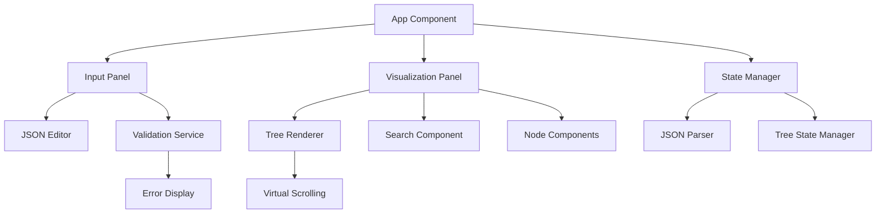

# Design Document

## Overview

The JSON Visualization App is a web-based application that provides an intuitive interface for visualizing and exploring JSON data structures. The app will feature a split-pane layout with a JSON input editor on one side and an interactive tree visualization on the other. The design emphasizes performance, usability, and accessibility while handling large JSON datasets efficiently.

## Architecture

The application follows a modular, component-based architecture using modern web technologies:



### Technology Stack
- **Frontend Framework**: Vue with TypeScript for type safety and component reusability
- **Styling**: Tailwind
- **JSON Parsing**: Native JSON.parse with custom error handling
- **Code Editor**: Monaco Editor or CodeMirror for syntax highlighting and validation
- **State Management**: pinia and tanstack query
- **Build Tool**: Vite for fast development and optimized builds

## Components and Interfaces

### Core Components

#### 1. App Component
- **Purpose**: Root component managing global state and layout
- **Props**: None (root component)
- **State**: Current JSON data, parsing errors, UI preferences
- **Responsibilities**: 
  - Coordinate between input and visualization panels
  - Handle global error states
  - Manage responsive layout

#### 2. JSONInputPanel Component
- **Purpose**: Handle JSON input and validation
- **Props**: `onJSONChange: (json: string) => void`, `validationErrors: ValidationError[]`
- **State**: Input value, editor configuration
- **Responsibilities**:
  - Provide syntax-highlighted JSON editor
  - Real-time validation feedback
  - Error highlighting and reporting

#### 3. VisualizationPanel Component
- **Purpose**: Render the JSON tree structure
- **Props**: `jsonData: ParsedJSON`, `searchQuery: string`
- **State**: Expanded nodes, selected elements
- **Responsibilities**:
  - Render tree structure with virtual scrolling
  - Handle node expansion/collapse
  - Implement search and filtering

#### 4. TreeNode Component
- **Purpose**: Render individual nodes in the JSON tree
- **Props**: `node: JSONNode`, `depth: number`, `isExpanded: boolean`
- **State**: Hover state, selection state
- **Responsibilities**:
  - Display key-value pairs with appropriate formatting
  - Handle click and hover interactions
  - Support copy-to-clipboard functionality

#### 5. SearchBar Component
- **Purpose**: Provide search functionality across JSON structure
- **Props**: `onSearch: (query: string) => void`, `resultCount: number`
- **State**: Search input, active search
- **Responsibilities**:
  - Filter JSON nodes based on keys/values
  - Highlight search matches
  - Navigate between search results

### Data Interfaces

```typescript
interface JSONNode {
  key: string | number;
  value: any;
  type: 'object' | 'array' | 'string' | 'number' | 'boolean' | 'null';
  children?: JSONNode[];
  path: string[];
  isExpandable: boolean;
}

interface ValidationError {
  line: number;
  column: number;
  message: string;
  severity: 'error' | 'warning';
}

interface TreeState {
  expandedNodes: Set<string>;
  selectedNode: string | null;
  searchResults: string[];
  currentSearchIndex: number;
}
```

## Data Models

### JSON Processing Pipeline

1. **Input Validation**: Raw JSON string validation using try-catch with JSON.parse
2. **Tree Construction**: Convert parsed JSON into hierarchical node structure
3. **Path Generation**: Generate unique paths for each node for state management
4. **Type Detection**: Identify data types for appropriate rendering and styling

### State Management Strategy

- **Global State**: JSON data, validation errors, UI preferences
- **Local State**: Component-specific states (expanded nodes, search, selection)
- **Derived State**: Computed values like filtered nodes, search matches
- **Persistence**: Save user preferences (theme, layout) to localStorage

## Error Handling

### JSON Parsing Errors
- **Detection**: Catch JSON.parse exceptions and extract error details
- **Display**: Show error location with line/column highlighting in editor
- **Recovery**: Allow partial visualization of valid JSON portions when possible

### Runtime Errors
- **Component Errors**: Vue 3 error handling with onErrorCaptured to catch rendering errors
- **Performance Issues**: Implement virtual scrolling for large datasets
- **Memory Management**: Lazy loading of deeply nested structures

### User Experience Errors
- **Empty State**: Provide helpful placeholder when no JSON is entered
- **Loading States**: Show progress indicators for large JSON processing
- **Accessibility**: Ensure keyboard navigation and screen reader support

## Testing Strategy

### Unit Testing
- **JSON Parser**: Test various JSON formats, edge cases, and error conditions
- **Tree Renderer**: Test node rendering, expansion/collapse, and search functionality
- **Validation Service**: Test error detection and message formatting
- **Utilities**: Test helper functions for path generation and type detection

### Integration Testing
- **Component Interaction**: Test communication between input and visualization panels
- **State Management**: Test state updates and synchronization
- **Search Functionality**: Test search across different JSON structures
- **Error Handling**: Test error propagation and recovery

### End-to-End Testing
- **User Workflows**: Test complete user journeys from input to visualization
- **Performance**: Test with large JSON files and complex structures
- **Accessibility**: Test keyboard navigation and screen reader compatibility
- **Cross-browser**: Test compatibility across modern browsers

### Performance Testing
- **Large Dataset Handling**: Test with JSON files of various sizes (1MB, 10MB+)
- **Memory Usage**: Monitor memory consumption during tree rendering
- **Rendering Performance**: Measure time to first meaningful paint
- **Virtual Scrolling**: Test smooth scrolling with thousands of nodes

## Implementation Considerations

### Performance Optimizations
- **Virtual Scrolling**: Render only visible nodes to handle large datasets
- **Memoization**: Use Vue 3 computed properties and watchEffect for efficient reactivity
- **Debounced Search**: Implement search debouncing to avoid excessive filtering
- **Lazy Loading**: Load nested structures on-demand for deep JSON trees

### Accessibility Features
- **Keyboard Navigation**: Full keyboard support for tree navigation
- **ARIA Labels**: Proper labeling for screen readers
- **Focus Management**: Logical focus flow and visible focus indicators
- **Color Contrast**: Ensure sufficient contrast for all UI elements

### Responsive Design
- **Mobile Layout**: Collapsible panels for mobile devices
- **Touch Interactions**: Touch-friendly expand/collapse controls
- **Flexible Sizing**: Resizable panels for different screen sizes
- **Progressive Enhancement**: Core functionality works without JavaScript